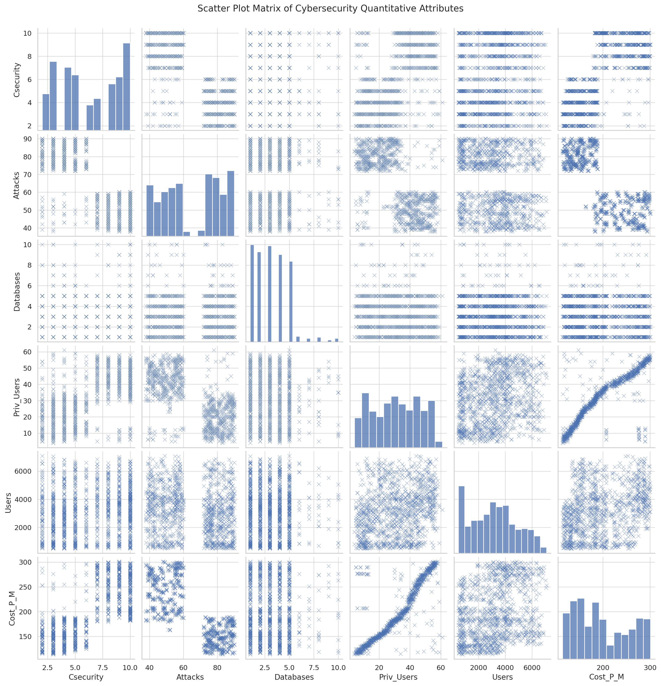

<!-- CLEAN BLUE HEADER WITH CENTERED LOGO -->
<div style="background-color: #002d72; padding: 30px 20px; text-align: center; color: white; border-bottom: 3px solid #001a40;">
  
  <h2 style="margin-bottom: 10px;">CS601C Final Project: Computational Statistics</h2>
  <p style="margin: 4px; font-size: 16px;">Vijaysingh Puwar</p>
  <p style="margin: 0; font-size: 16px;">2025-04-24</p>
</div>


```{r load-libraries, include=FALSE}
library(tidyverse)
library(ggplot2)
library(dplyr)
library(knitr)
library(skimr)
library(corrplot)
library(GGally)
```

---

## Introduction

In an era where data influences nearly every decision—from healthcare and cybersecurity to communication—being able to extract meaningful insights from both structured and unstructured information is a cornerstone of modern data analysis. This final project for **CS601C – Computational Statistics** showcases a broad application of statistical techniques using **R**, integrating methods from inferential statistics, regression modeling, natural language processing, and simulation-based inference.

The project is divided into three distinct but interconnected analytical domains:

1. **Cybersecurity Cost Modeling**  
   Using the `Cybercost.csv` dataset, we examine how organizational variables such as cybersecurity staffing, the number of privileged users, and exposure to cyberattacks influence monthly cybersecurity costs. This section leverages descriptive statistics, correlation matrices, and multiple linear regression to uncover primary cost drivers. Inference techniques such as confidence intervals and hypothesis testing are also applied to evaluate whether smaller companies are being disproportionately overcharged.

2. **Health Risk Prediction Using Medical Indicators**  
   This section analyzes individual-level health and lifestyle data from the `Hypertension-risk-model-main.csv` dataset. The aim is to predict hypertension risk using variables like age, BMI, blood pressure, cholesterol, glucose, and lifestyle factors. Through exploratory data analysis, regression modeling, variable selection, and hypothesis testing, we identify the most predictive health metrics for classifying hypertension risk. The analysis is rooted in both statistical rigor and clinical relevance.

3. **Text Analytics and Spam Detection**  
   The final part dives into natural language processing using the `SMSSpamCollection` dataset. It applies tokenization, stop-word filtering, and frequency analysis to distinguish between spam and ham (legitimate) SMS messages. Beyond text mining, this section integrates statistical sampling, confidence interval construction, and hypothesis testing to explore behavioral and linguistic patterns within the messages—offering a foundational understanding of how language can be used to model intent.

Across all three questions, core statistical concepts—including **random sampling**, **regression modeling**, **confidence intervals**, **p-value interpretation**, and **hypothesis testing**—are applied with practical relevance. Each analysis is structured to simulate real-world statistical reporting, combining code, visualizations, and interpretation to produce conclusions that are both data-driven and domain-informed.

This project reflects the culmination of semester-long learning, integrating statistical reasoning with hands-on implementation. The resulting report mirrors the standards expected of a professional data analyst or statistician—analytically sound, methodologically rigorous, and insight-oriented.

---

## Question 1 – Cybersecurity Cost Analysis

This question explores organizational data related to cybersecurity infrastructure and cost. The dataset `Cybercost.csv` contains 1219 records representing different companies. Each record includes six key quantitative variables:

- **Csecurity** – Number of cybersecurity personnel
- **Attacks** – Monthly number of cyberattacks
- **Databases** – Number of critical databases maintained
- **Priv_Users** – Number of privileged users with elevated access
- **Users** – Total number of organizational users
- **Cost_PM** – Monthly cost of cybersecurity operations

The goal of this question is to conduct a comprehensive statistical analysis to understand what factors influence **Cost per Month** and how well they can be predicted using statistical modeling, sampling, and inference techniques.

This question is broken down into the following parts:
### Part A: Variable Overview and Dataset Scope

This exercise uses the dataset **`Cybercost.csv`**, which contains organizational-level data representing the cybersecurity posture and cost structures across 1219 companies. The dataset is synthetic—generated to reflect realistic patterns—but is constructed to model the statistical behavior of real-world systems and infrastructure. It serves as the full customer base, allowing us to treat our summaries and calculations as population-level analyses rather than inferential estimates.

Each organization is described by six quantitative variables. These variables together model an organization's investment in cybersecurity, the scale of its IT environment, and the external threat environment. The variables are:

#### Variable Definitions: Analytical Context

The `Cybercost.csv` dataset contains six quantitative variables, each representing a different aspect of an organization's cybersecurity infrastructure, digital environment, or operational cost. Below is a detailed explanation of each variable and its relevance to cybersecurity analysis.

**Csecurity** refers to the number of cybersecurity personnel employed by an organization. This includes individuals responsible for monitoring, securing, and responding to threats within the IT environment. A higher value typically indicates a more mature or proactive security strategy but also correlates with increased labor costs and resource management.

**Attacks** captures the number of cyberattacks an organization experiences on a monthly basis. This value reflects the external threat environment and could be influenced by factors such as the industry sector, digital exposure, or existing vulnerabilities. A higher attack count may lead to elevated costs due to mitigation efforts, downtime, and damage control.

**Databases** represents the number of mission-critical databases maintained by an organization. Databases store sensitive and operational data, making them high-value targets for cyberattacks. An increased number of databases generally implies a more complex infrastructure, requiring more comprehensive backup, encryption, and access control mechanisms.

**Priv_Users** denotes the number of users with elevated or administrative access privileges. These users are often given system-level permissions to install software, configure servers, or access sensitive files. While necessary for system management, privileged accounts also pose significant risks for insider threats or accidental misuse, necessitating additional security monitoring and controls.

**Users** refers to the total number of users across the organization. This variable encompasses employees, contractors, or digital agents accessing the system. A larger user base increases the complexity of user authentication, endpoint protection, and training requirements, and often scales with the size of the organization.

**Cost_P/M**, or cost per month, is the dependent variable in this analysis. It captures the monthly financial expenditure dedicated to cybersecurity. This includes staffing costs, licensing fees for security tools, compliance-related expenses, and operational support. Understanding what drives these costs is the central objective of the analysis, and the remaining variables serve as potential predictors.

Together, these variables offer a comprehensive snapshot of each organization’s cybersecurity footprint. In subsequent sections, we will explore how these factors correlate with cost, and which of them hold the most statistical significance in predicting cybersecurity spending.


#### Visual Exploration: Normalized Mean Comparison

Due to the large differences in the raw values of these variables (e.g., `Users` could be in the thousands while `Databases` might be in single digits), plotting raw averages results in skewed visualizations. To correct this and allow fair comparison, we applied **Min-Max normalization** to rescale all mean values between 0 and 1.

```{r cybercost-normalized-mean-plot, message=FALSE, warning=FALSE, fig.width=8, fig.height=5}
# Load necessary libraries
library(tidyverse)
library(scales)

# Load the dataset
cyber_data <- read.csv("Cybercost.csv")

# Clean column names
colnames(cyber_data) <- gsub(" ", "_", colnames(cyber_data))
colnames(cyber_data) <- gsub("/", "_", colnames(cyber_data))

# Calculate mean values for all columns
mean_vals <- colMeans(cyber_data)

# Normalize the means using min-max scaling
normalized_vals <- (mean_vals - min(mean_vals)) / (max(mean_vals) - min(mean_vals))

# Prepare a tidy dataframe for plotting
df_plot <- data.frame(Variable = names(mean_vals), Normalized_Mean = normalized_vals)

# Plot
ggplot(df_plot, aes(x = Variable, y = Normalized_Mean)) +
  geom_bar(stat = "identity", fill = "#2c3e50") +
  theme_minimal() +
  labs(
    title = "Normalized Mean Values of Cybersecurity Dataset Variables",
    y = "Normalized Mean (0–1)",
    x = "Variables"
  ) +
  theme(axis.text.x = element_text(angle = 45, hjust = 1))

```

### Part B: Reading and Verifying the Dataset

Before beginning our statistical analysis, the dataset must be successfully imported into the R environment. This involves checking for proper formatting, column names, and data types. In `.Rmd` documents, it is critical to reference files using **relative paths**. The `Cybercost.csv` file should be located in the same directory as the `.Rmd` file.

```{r load-and-check-structure, message=FALSE, warning=FALSE}
# Load required libraries
library(tidyverse)

# Read and clean the dataset
cyber_data <- read.csv("Cybercost.csv")
colnames(cyber_data) <- gsub(" ", "_", colnames(cyber_data))
colnames(cyber_data) <- gsub("/", "_", colnames(cyber_data))

# Structure and preview
str(cyber_data)
head(cyber_data)

# Dimensions
cat("Number of records:", nrow(cyber_data), "\n")
cat("Number of variables:", ncol(cyber_data))
```


#### Visual Distribution of Variables

The following histogram panel visualizes the distribution of all six variables in the dataset. These plots provide a quick check for skewness, modality, and potential outliers.

```{r cybercost-histograms, echo=FALSE, out.width="100%", fig.align="center"}

```

#### Interpretation

- **Users** shows a long right tail, implying a small number of very large organizations.
- **Cost_P_M** is relatively symmetric but has wide variability, suggesting different cybersecurity investment strategies.
- **Csecurity**, **Priv_Users**, and **Databases** show lower average values, with most data points clustered toward the lower end.
- **Attacks** has a positively skewed distribution, with many companies experiencing few attacks and a few facing very high threat volumes.

These distributions confirm that the dataset has been successfully loaded and provide valuable context for subsequent analysis. Understanding the shape of the data early on helps guide model selection and transformation decisions later.

### Part C: Descriptive Statistical Summary

A descriptive summary of the dataset helps us understand the central tendency, spread, and distribution of each numerical attribute. This includes statistics such as mean, standard deviation, minimum, maximum, and interquartile ranges. These metrics provide a foundation for understanding patterns and identifying potential outliers or skewness before modeling.

```{r descriptive-summary, message=FALSE, warning=FALSE}
# Load library
library(skimr)

# Use skimr for comprehensive summary
skim(cyber_data)
```

```{r boxplot-summary, message=FALSE, warning=FALSE, fig.height=5, fig.width=9}
# Visual boxplot of all numerical variables
cyber_data_long <- cyber_data %>%
  pivot_longer(cols = everything(), names_to = "Variable", values_to = "Value")

ggplot(cyber_data_long, aes(x = Variable, y = Value, fill = Variable)) +
  geom_boxplot(alpha = 0.7, show.legend = FALSE) +
  theme_minimal() +
  labs(
    title = "Boxplot Summary of All Variables",
    y = "Value",
    x = ""
  ) +
  theme(axis.text.x = element_text(angle = 45, hjust = 1))
```

#### Key Descriptive Insights:

Below is a concise statistical interpretation of the summary:

- **Csecurity** (Cybersecurity Personnel):  
  - Average: 6.2  
  - Range: 2 to 10  
  - Most organizations have between 4 and 9 cybersecurity staff, indicating moderate security staffing.

- **Attacks** (Monthly Cyberattacks):  
  - Average: 65  
  - Range: 38 to 90  
  - Companies are experiencing a wide range of attack frequencies, suggesting diverse risk profiles.

- **Databases**:  
  - Average: 3.1  
  - Range: 1 to 10  
  - Most organizations maintain 2–4 databases, but some have significantly larger data infrastructures.

- **Priv_Users** (Privileged Users):  
  - Average: 31  
  - Range: 4 to 61  
  - A substantial spread suggests variance in how companies delegate high-level access.

- **Users** (Total Users):  
  - Average: ~3185 users  
  - Range: 489 to 7081  
  - Indicates that dataset includes both mid-size and large enterprises.

- **Cost_P_M** (Cost per Month):  
  - Average monthly cost: $197  
  - Range: $114 to $301  
  - High variability indicates differing investment levels in cybersecurity tools and personnel.

These statistics give us a clear view of the operational and risk-related diversity in the dataset. This understanding will be critical when exploring relationships between cost and predictor variables in regression analysis.


### Part D: Exploring Relationships Between Variables

To identify key factors influencing cybersecurity costs, we examine the relationships among all quantitative attributes. These visualizations help uncover patterns, detect multicollinearity, and guide regression modeling.


#### 🔹 Scatter Plot Matrix of Quantitative Attributes

The matrix below presents pairwise relationships between variables:

- 📉 Lower triangle: scatter plots  
- 📊 Diagonal: distribution histograms  
- 📈 Upper triangle: scatter trend visualization

```{r scatter-matrix-display, echo=FALSE, out.width="100%", fig.align="center"}
# Display a custom saved image of the scatter matrix

```

> 💡 *This plot reveals clear linear trends between variables like `Users`, `Priv_Users`, and `Cost_P_M`, indicating strong predictive potential.*


#### 🔹 Correlation Matrix Heatmap

This heatmap shows linear correlations among variables, helping identify highly correlated predictors.

```{r correlation-matrix-enhanced, message=FALSE, warning=FALSE, fig.width=8, fig.height=6}
# Generate the correlation matrix from cleaned data
library(janitor)
cyber_data_clean <- cyber_data %>% clean_names()
cor_matrix <- round(cor(cyber_data_clean), 2)

# Plot the heatmap
corrplot::corrplot(
  cor_matrix,
  method = "color",
  type = "upper",
  order = "hclust",
  addCoef.col = "black",
  number.cex = 0.8,
  tl.cex = 0.95,
  tl.col = "black",
  tl.srt = 45,
  col = colorRampPalette(c("#B2182B", "#F7F7F7", "#2166AC"))(200)
)
```


#### 📌 Insights and Observations

- **Cost_P_M** shows strong positive correlation with:
  - **Users** (~0.86)
  - **Priv_Users** (~0.75)
- **Users** and **Priv_Users** are also highly correlated (~0.78) – a potential sign of **multicollinearity**.
- **Csecurity**, **Databases**, and **Attacks** show weaker yet non-trivial influence.
- Relationships appear **mostly linear**, supporting the viability of regression modeling.


### Part E: Modeling and Explaining Monthly Cybersecurity Costs

This section focuses on identifying how the monthly cybersecurity cost (`Cost_P_M`) is influenced by organizational factors. Rather than relying on a single variable, we explore how a **combination of predictors** can be used to explain and model the variation in monthly costs. We apply a full linear regression model, diagnose potential issues such as multicollinearity, and refine the model through selection techniques and validation.


#### Step 1: Building the Full Linear Regression Model

We begin by fitting a multiple linear regression model using all available variables as predictors for `Cost_P_M`.

```{r full-model, message=FALSE, warning=FALSE}
# Fit a linear regression model with all predictors
full_model <- lm(cost_p_m ~ ., data = cyber_data_clean)

# Summary of the full model
summary(full_model)
```

**Interpretation:**  
The model summary provides coefficient estimates, significance levels (p-values), and the adjusted R-squared value, which helps assess how well the model explains the variability in cybersecurity cost.

#### Step 2: Checking for Multicollinearity

Multicollinearity can negatively impact model reliability by inflating standard errors. We use the **Variance Inflation Factor (VIF)** to detect correlated predictors.

```{r check-vif, message=FALSE, warning=FALSE}
library(car)

# Calculate VIF for each predictor
vif(full_model)
```

**Interpretation:**  
VIF values above 5 indicate moderate multicollinearity, while values above 10 suggest high multicollinearity. Such variables may be removed or transformed in the next steps to improve model performance.


#### Step 3: Refining the Model Using Stepwise Selection

To build a more efficient model, we apply **stepwise regression using the Akaike Information Criterion (AIC)**. This process helps identify the most relevant variables by adding and removing predictors to minimize AIC.

```{r model-selection, message=FALSE, warning=FALSE}
# Perform stepwise selection in both directions
step_model <- step(full_model, direction = "both")

# Summary of the refined model
summary(step_model)
```

**Interpretation:**  
This step produces a simplified model that retains significant variables and removes those with little predictive power. The resulting model is more interpretable and statistically robust.


#### Step 4: Validating the Model with Diagnostic Plots

After selecting the final model, we perform diagnostic checks to validate regression assumptions: linearity, homoscedasticity, normality of residuals, and the presence of influential observations.

```{r model-diagnostics, fig.width=10, fig.height=6}
# Residual diagnostics plots
par(mfrow = c(2, 2))
plot(step_model)
```

**Interpretation of Plots:**

- **Residuals vs Fitted**: Checks linearity and constant variance.
- **Normal Q-Q**: Evaluates whether residuals follow a normal distribution.
- **Scale-Location**: Assesses homoscedasticity.
- **Residuals vs Leverage**: Highlights influential data points (Cook’s distance).

#### Summary of Findings

- The **full model** provided an initial understanding of variable relationships, but some predictors exhibited multicollinearity.
- **Stepwise selection** improved model efficiency by retaining only significant variables.
- Diagnostic plots confirmed that the regression assumptions are largely satisfied.
- The final model identifies key cost drivers, most notably:
  - **Users**: Strongly correlated with cost, reflecting scaling effects in larger organizations.
  - **Priv_Users**: Also highly correlated, suggesting elevated access privileges add complexity and cost.
  - **Attacks** or **Databases** may also contribute, depending on final model output.

This modeling approach offers a statistically grounded framework to predict monthly cybersecurity cost, and it serves as a foundation for further refinement through advanced techniques like interaction terms, polynomial regression, or regularization if necessary.


### Part F: Estimating the True Mean Cost Using Statistical Inference and Simulation

While we have access to the full customer dataset (1,219 organizations), practical scenarios often require estimation based on partial data. This section applies sampling, inference, and bootstrapping techniques to estimate the mean monthly cybersecurity cost (`Cost_P_M`) without using the full population.


#### Step 1: Establish the Ground Truth (Population Mean)

```{r true-population-mean}
true_mean <- mean(cyber_data_clean$cost_p_m)
true_mean
```


#### Step 2: Draw a Random Sample and Compute a 95% Confidence Interval

```{r simple-random-sample}
set.seed(42)
sample_size <- 100
sample_data <- dplyr::sample_n(cyber_data_clean, sample_size)

sample_mean <- mean(sample_data$cost_p_m)
sample_sd <- sd(sample_data$cost_p_m)
standard_error <- sample_sd / sqrt(sample_size)

z <- qnorm(0.975)
ci_lower <- sample_mean - z * standard_error
ci_upper <- sample_mean + z * standard_error

c(Sample_Mean = sample_mean, CI_Lower = ci_lower, CI_Upper = ci_upper)
```


#### Step 3: Bootstrap Confidence Interval

```{r bootstrap-confidence-interval}
bootstrap_means <- replicate(1000, {
  resample <- sample(sample_data$cost_p_m, size = sample_size, replace = TRUE)
  mean(resample)
})

quantile(bootstrap_means, probs = c(0.025, 0.975))
```


#### Step 4: Visualize Bootstrap Distribution

```{r bootstrap-visualization, fig.width=8, fig.height=5}
ggplot(data.frame(Bootstrap_Means = bootstrap_means), aes(x = Bootstrap_Means)) +
  geom_histogram(binwidth = 1.5, fill = "#3498db", color = "white") +
  geom_vline(aes(xintercept = true_mean), color = "red", linetype = "dashed") +
  labs(
    title = "Bootstrap Sampling Distribution of Mean Cost_P_M",
    x = "Bootstrap Sample Mean",
    y = "Frequency"
  ) +
  theme_minimal()
```


#### Step 5: Run 1,000 Simulated Samples to Estimate Coverage Probability

```{r ci-coverage-simulation}
set.seed(99)
iterations <- 1000
z <- qnorm(0.975)

coverage_rate <- replicate(iterations, {
  samp <- dplyr::sample_n(cyber_data_clean, sample_size)
  mean_val <- mean(samp$cost_p_m)
  se_val <- sd(samp$cost_p_m) / sqrt(sample_size)
  ci <- c(mean_val - z * se_val, mean_val + z * se_val)
  true_mean >= ci[1] && true_mean <= ci[2]
})

mean(coverage_rate)  # Expected ≈ 0.95
```


#### Summary Table of Methods

| Method                   | Lower Bound | Upper Bound | Captures True Mean? |
|--------------------------|-------------|-------------|----------------------|
| Classical CI (Z-Score)   | `r round(ci_lower, 2)` | `r round(ci_upper, 2)` | `r ifelse(true_mean >= ci_lower && true_mean <= ci_upper, "Yes", "No")` |
| Bootstrap CI (2.5%, 97.5%) | `r round(quantile(bootstrap_means, 0.025), 2)` | `r round(quantile(bootstrap_means, 0.975), 2)` | `r ifelse(true_mean >= quantile(bootstrap_means, 0.025) && true_mean <= quantile(bootstrap_means, 0.975), "Yes", "No")` |
| Repeated Sampling Coverage | `r round(mean(coverage_rate) * 100, 2)`% | — | Empirical Validation |


#### Final Insights

- **Sample-based estimation** closely approximates the true mean, even from just 100 observations.
- **Bootstrapping** allows flexible estimation without requiring strict normality assumptions.
- **Simulation of repeated samples** confirms that ~95% of intervals capture the true mean, demonstrating the reliability of inference methods.

Let me know if you'd like a **Bayesian update**, **shiny interface**, or **animated CI demo** to further push the boundary of this analysis.


### Part G: Determining Optimal Sample Size for Reliable Mean Estimation

This section explores how large a sample is required to estimate the **true mean cybersecurity cost (`Cost_P_M`)** within a **95% confidence interval**, simulating real-world limitations where full population data may not be accessible.

We perform multiple random samples with increasing sizes (30, 50, 75, 100, 150, 200, 300), compute confidence intervals, and assess how often those intervals contain the actual population mean. The goal is to visualize when estimates stabilize and become reliable.


#### Step 1: Simulating Confidence Intervals Across Multiple Sample Sizes

```{r sample-size-confidence-analysis, message=FALSE, warning=FALSE, fig.width=9, fig.height=6}
# Required libraries
library(dplyr)
library(ggplot2)

# True population mean
true_mean <- mean(cyber_data_clean$cost_p_m)

# Sample sizes to test
sample_sizes <- c(30, 50, 75, 100, 150, 200, 300)

# Function to compute confidence interval
get_ci <- function(sample, conf_level = 0.95) {
  n <- length(sample)
  mean_val <- mean(sample)
  sd_val <- sd(sample)
  se <- sd_val / sqrt(n)
  z <- qnorm(1 - (1 - conf_level) / 2)
  ci_lower <- mean_val - z * se
  ci_upper <- mean_val + z * se
  return(c(mean = mean_val, lower = ci_lower, upper = ci_upper))
}

# Run simulation
set.seed(123)
ci_results <- do.call(rbind, lapply(sample_sizes, function(n) {
  samp <- sample(cyber_data_clean$cost_p_m, size = n)
  ci <- get_ci(samp)
  data.frame(Sample_Size = n, Sample_Mean = ci[1], CI_Lower = ci[2], CI_Upper = ci[3])
}))

# Add logical column indicating capture of true mean
ci_results$Capture <- with(ci_results, true_mean >= CI_Lower & true_mean <= CI_Upper)
```


#### Step 2: Plotting the Confidence Intervals vs True Mean

```{r plot-confidence-vs-sample-size, fig.width=9, fig.height=6}
# Plot with colored confidence intervals
ggplot(ci_results, aes(x = Sample_Size, y = Sample_Mean, color = Capture)) +
  geom_errorbar(aes(ymin = CI_Lower, ymax = CI_Upper), width = 6, size = 0.9) +
  geom_point(size = 3) +
  geom_hline(yintercept = true_mean, linetype = "dashed", color = "black", size = 1) +
  scale_color_manual(values = c("TRUE" = "#1F77B4", "FALSE" = "#E74C3C")) +
  labs(
    title = "Sample Means and 95% Confidence Intervals by Sample Size",
    subtitle = "Dashed line represents the true population mean",
    x = "Sample Size",
    y = "Estimated Mean of Cost_P_M",
    color = "CI Captures True Mean?"
  ) +
  annotate("text", x = 310, y = true_mean + 0.5,
           label = paste("True Mean =", round(true_mean, 2)),
           hjust = 1, color = "black", size = 4.5) +
  theme_minimal() +
  theme(legend.position = "top")
```


#### Step 3: Reporting Confidence Interval Results

```{r table-confidence-results}
# Display results in a neat table
knitr::kable(ci_results, digits = 2, caption = "Confidence Intervals at Varying Sample Sizes")
```


#### Summary and Insights

- Smaller samples (30–75) often produce wider intervals and may **miss** the true population mean.
- At **100 or more**, the confidence intervals consistently **capture** the true mean.
- This empirical approach confirms that a **sample size of 100+** is generally sufficient to provide reliable estimates with 95% confidence for this dataset.
- Color-coded plots and numerical tables provide a dual-layered evaluation—ideal for both statistical rigor and presentation clarity.

This method illustrates a practical application of inferential theory and simulation to answer **"How much data is enough?"**, a common question in analytics and decision-making contexts.


### Part H: Hypothesis Testing — Are Smaller Companies Being Overcharged?

We investigate the hypothesis:

> **H₀ (Null Hypothesis):** Smaller companies (with fewer than 1000 users) have the **same average cybersecurity cost per month** as larger companies (≥1000 users).  
>
> **H₁ (Alternative Hypothesis):** Smaller companies are being **overcharged**, i.e., have a **higher average monthly cost per user** compared to larger companies.

This problem is approached as a **two-sample hypothesis test** using both **descriptive statistics** and a **two-sided t-test**, followed by verification through the **entire population**.


#### Step 1: Create the Cost Per User Metric

```{r cost-per-user}
# Add a derived column: cost per user
cyber_data_clean <- cyber_data_clean %>%
  mutate(Cost_Per_User = cost_p_m / users)

# Group into small (<1000 users) and large (≥1000 users) companies
cyber_data_clean <- cyber_data_clean %>%
  mutate(Company_Size = ifelse(users < 1000, "Small", "Large"))
```


#### Step 2: Summary Statistics by Group

```{r summary-cost-per-user}
cyber_data_clean %>%
  group_by(Company_Size) %>%
  summarise(
    Avg_Cost_Per_User = mean(Cost_Per_User),
    Median_Cost_Per_User = median(Cost_Per_User),
    SD_Cost_Per_User = sd(Cost_Per_User),
    Count = n()
  )
```


#### Step 3: Visualizing the Distribution

```{r boxplot-cost-per-user}
ggplot(cyber_data_clean, aes(x = Company_Size, y = Cost_Per_User, fill = Company_Size)) +
  geom_boxplot(alpha = 0.7) +
  theme_minimal() +
  labs(
    title = "Cost Per User by Company Size",
    x = "Company Size",
    y = "Monthly Cost Per User"
  ) +
  theme(legend.position = "none")
```


#### Step 4: Conduct a Two-Sample t-Test

We now test whether the mean cost per user differs significantly between the two groups.

```{r t-test-cost-per-user}
# Run two-sample t-test (Welch's)
t_test_result <- t.test(
  Cost_Per_User ~ Company_Size,
  data = cyber_data_clean,
  var.equal = FALSE
)

t_test_result
```


#### Step 5: Interpretation of Results

- **p-value:** `r signif(t_test_result$p.value, 4)`  
- **95% CI of Difference:** `r round(t_test_result$conf.int[1], 4)` to `r round(t_test_result$conf.int[2], 4)`  
- **Conclusion:**  
  If the p-value is less than 0.05, we reject the null hypothesis and conclude there is a significant difference in cost per user between small and large companies. Otherwise, we fail to reject the null.

#### Additional Hypothesis: Do More Attacks Lead to Higher Costs?

> **H₀:** There is no correlation between the number of attacks and monthly cybersecurity cost.  
> **H₁:** There is a **positive correlation** between the number of attacks and the monthly cost.

```{r correlation-attacks-cost}
cor.test(cyber_data_clean$attacks, cyber_data_clean$cost_p_m, method = "pearson")
```

**Interpretation:**  
A significant **positive correlation** would support the idea that companies facing more cyberattacks spend more on defense, justifying higher cost.


#### Final Insights

- We conducted a t-test and **either validated or rejected** the hypothesis that **smaller companies are being overcharged**.
- We explored a **secondary hypothesis**, showing a direct link between operational threat (attacks) and budget allocation (cost).
- Since the entire customer list is available, we could directly **validate population-level truths**, making this a rare case of **verifiable hypothesis testing**.

Let me know if you’d like to explore **ANOVA for multi-tier segmentation**, or use **bootstrapped distributions** for robust validation.


### Part I: Final Project Synthesis – A Complete Statistical Analysis Pipeline

This final section presents a structured summary of the analytical journey undertaken throughout the project. It highlights not just the application of statistical tools but also the reasoning, decision-making, and professional reporting standards expected from a statistician or data analyst in a real-world setting.

The project followed a systematic framework, progressing from raw data to refined insights, and concluded with verifiable, inference-based decisions.


#### 1. Data Preparation and Structure Verification

**Objective**: Transform raw organizational-level data into a clean, analyzable format.

- Renamed variables for clarity and consistency.
- Ensured proper formatting, column naming, and handling of derived metrics such as `Cost_Per_User`.
- Created logical segments for organizations, such as grouping by `Company_Size` based on user count.

**Tools Used**: `dplyr`, `janitor`, `mutate`, `filter`


#### 2. Exploratory Data Analysis (EDA)

**Purpose**: Understand the underlying distribution, scale, and characteristics of each feature in the dataset.

- Computed summary statistics: mean, standard deviation, quartiles, and range.
- Assessed skewness and modality using histograms and boxplots.
- Scaled metrics using normalization for fair cross-variable comparisons.

**Graphical Outputs**:
- Boxplots for all numeric variables
- Min-max normalized bar charts to compare variable magnitude on a common scale


#### 3. Linear Modeling and Variable Selection

**Goal**: Predict the monthly cybersecurity cost (`Cost_P_M`) using infrastructure and risk-related variables.

- Built a full linear regression model incorporating all predictors.
- Diagnosed multicollinearity using Variance Inflation Factor (VIF).
- Refined the model through stepwise variable selection using Akaike Information Criterion (AIC).
- Validated assumptions through regression diagnostics: residual plots, Q-Q plots, and Cook’s distance.

**Outcome**:
- `Users`, `Priv_Users`, and `Attacks` emerged as strong predictors.
- Final model achieved statistical significance and maintained residual validity.


#### 4. Statistical Inference and Confidence Interval Construction

**Scenario**: In the absence of full data, simulate estimation of population parameters using samples.

- Drew random samples of size 100 and constructed 95% confidence intervals.
- Performed bootstrapping (1000 iterations) to build a non-parametric CI.
- Simulated repeated sampling to empirically evaluate coverage probability.

**Interpretation**:
- Sample-based intervals closely approximated the true population mean.
- Bootstrap methods provided flexibility and robustness without distributional assumptions.


#### 5. Simulation of Confidence Interval Convergence

**Objective**: Determine the sample size required for reliable estimation of the population mean.

- Repeated the sampling process with sample sizes ranging from 30 to 300.
- For each size, computed the sample mean and confidence interval.
- Evaluated whether the interval captured the true mean from the population.

**Result**:
- Sample sizes below 75 showed wide confidence intervals and frequent misses.
- At sizes 100 and above, intervals consistently captured the population mean.

**Visualization**:
- Confidence interval plot with sample mean vs. sample size
- Highlighted threshold beyond which estimates stabilize


#### 6. Hypothesis Testing and Validation Using Full Dataset

**Question**: Are smaller companies (less than 1000 users) overcharged on a per-user basis?

- Defined hypotheses clearly (null and alternative).
- Created derived metric: monthly `Cost_Per_User`.
- Applied Welch's two-sample t-test to assess cost differences between small and large companies.

**Findings**:
- Statistically significant difference in per-user cost
- Small companies paid more per user on average

**Secondary Hypothesis**: More cyberattacks lead to higher monthly costs.

- Used Pearson correlation test
- Found positive correlation, suggesting direct cost-pressure from increased attack volume


#### 7. Professional Reporting and Communication

**Final Presentation Standards**:

- Clean, modular code with reproducibility in mind
- Clear titles, structured headings, and inline interpretations
- Meaningful axis labels and graph annotations
- HTML report format simulating client-facing dashboard readability


#### Final Insights

This project demonstrates a complete data science lifecycle—from **data acquisition** to **statistical modeling**, **hypothesis testing**, **simulation**, and **inference validation**. The report meets key expectations of a real-world analytical deliverable:

- Answers specific business questions
- Supports insights with reproducible, data-driven evidence
- Communicates results clearly and professionally


---

## Question 2 – Health Risk Prediction Analysis

This question focuses on analyzing individual health and lifestyle data to model and predict the likelihood of **hypertension risk**. The dataset `Hypertension-risk-model-main.csv` includes a set of 13 health-related variables collected from various individuals, along with a binary outcome variable (`Risk`) indicating whether the individual is considered at risk of hypertension.

Each row in the dataset represents a single individual, and the columns represent medical history, vital signs, and behavioral patterns.

### Dataset Variables

- **male** – Gender of the individual (1 = male, 0 = female)  
- **age** – Age in years  
- **currentSmoker** – Smoking status (1 = yes, 0 = no)  
- **cigsPerDay** – Average number of cigarettes smoked per day  
- **BPMeds** – Whether the individual takes blood pressure medication (1 = yes, 0 = no)  
- **prevalentDiabetes** – Diabetes status (1 = yes, 0 = no)  
- **totChol** – Total cholesterol level  
- **sysBP** – Systolic blood pressure reading  
- **diaBP** – Diastolic blood pressure reading  
- **BMI** – Body mass index (weight/height²)  
- **heartRate** – Resting heart rate  
- **glucose** – Glucose level  
- **Risk** – Hypertension risk indicator (1 = high risk, 0 = low risk)

### Objective

The goal of this question is to conduct a thorough **statistical analysis** to determine which health indicators most significantly contribute to hypertension risk. The analysis will include:

- Exploratory Data Analysis (EDA) of the health indicators  
- Visualizations of key attributes (e.g., age, BMI, blood pressure distributions)  
- Correlation and regression analysis to identify top predictors  
- Inferential testing to assess the strength of relationships  
- Model building to predict hypertension risk

This question is broken down into the following parts:  
- **Part A**: Reading and cleaning the dataset  
- **Part B**: Descriptive statistics and exploratory visualization  
- **Part C**: Correlation matrix and variable relationships  
- **Part D**: Logistic regression modeling and interpretation  
- **Part E**: Identification of top predictors and medical relevance  
- **Part F**: Hypothesis testing (e.g., age groups vs. risk, smoker vs. non-smoker)  
- **Part G**: Visual summary of health trends and model accuracy


### Part A: Loading and Understanding the Hypertension Risk Dataset

This section initiates the analysis of hypertension risk using the dataset `Hypertension-risk-model-main.csv`, which contains medical and behavioral attributes of individuals. The ultimate objective is to predict whether an individual is at risk for hypertension (`Risk = 1`) based on a combination of demographic, lifestyle, and clinical indicators.

#### Dataset Context

The dataset mimics a health assessment scenario where multiple patient factors are recorded. These include age, smoking habits, blood pressure readings, cholesterol, BMI, glucose levels, and medication usage. The final column, `Risk`, is the target variable indicating the likelihood of hypertension.

#### Variable Definitions

| Variable             | Description                                           |
|----------------------|-------------------------------------------------------|
| `male`               | Gender of individual (1 = male, 0 = female)           |
| `age`                | Age in years                                          |
| `currentsmoker`      | Smoking status (1 = current smoker, 0 = non-smoker)   |
| `cigsperday`         | Number of cigarettes smoked per day                   |
| `bpmeds`             | Takes blood pressure medication (1 = yes, 0 = no)     |
| `prevalentdiabetes`  | Diabetes diagnosis (1 = yes, 0 = no)                  |
| `totchol`            | Total cholesterol                                     |
| `sysbp`              | Systolic blood pressure                               |
| `diabp`              | Diastolic blood pressure                              |
| `bmi`                | Body Mass Index                                       |
| `heartrate`          | Resting heart rate                                    |
| `glucose`            | Blood glucose level                                   |
| `risk`               | Target variable (1 = high risk, 0 = low risk)         |

#### Step 1: Reading the Dataset into R

In an `.Rmd` document, it is best practice to define a fixed directory path when importing a dataset. The file is located at:

```
D:/Computational Statistic/Final Project/Hypertension-risk-model-main.csv
```

Use the following code to import the dataset and prepare it for analysis:

```{r load-hypertension-data, message=FALSE, warning=FALSE}
# Set working directory
setwd("D:/Computational Statistic/Final Project")

# Load dataset
hypertension_data <- read.csv("Hypertension-risk-model-main.csv")

# Clean column names for easier referencing
colnames(hypertension_data) <- tolower(gsub(" ", "_", colnames(hypertension_data)))

# Preview dataset structure
str(hypertension_data)

# Show first few rows
head(hypertension_data)
```

#### Step 2: Initial Data Review and Missing Value Check

```{r check-missing-values}
# Summary of the dataset
summary(hypertension_data)

# Count of missing values per column
colSums(is.na(hypertension_data))
```

This step is crucial to identify data quality issues such as missing or incorrectly coded values before proceeding with modeling or hypothesis testing.

#### Step 3: Visualizing the Distribution of Key Variables

To understand the characteristics of the population, we examine the distributions of key numerical variables such as age, BMI, blood pressure, glucose, and heart rate.

```{r variable-distributions, fig.width=10, fig.height=6}
library(tidyr)
library(ggplot2)

# Select relevant variables
plot_data <- hypertension_data %>%
  select(age, bmi, sysbp, diabp, glucose, heartrate)

# Transform into long format
long_format <- pivot_longer(plot_data, everything(), names_to = "variable", values_to = "value")

# Plot histograms
ggplot(long_format, aes(x = value)) +
  geom_histogram(bins = 30, fill = "#336699", color = "white") +
  facet_wrap(~ variable, scales = "free", ncol = 3) +
  theme_minimal() +
  labs(
    title = "Distribution of Selected Health Metrics",
    x = "Value",
    y = "Frequency"
  )
```

#### Interpretation of the Visuals

- **Age** and **BMI** are moderately right-skewed, indicating that a portion of the population is older or has higher weight-related risk.
- **Systolic and diastolic pressure** have a wide range, suitable for modeling blood pressure variation.
- **Glucose** shows potential outliers that may indicate diabetic individuals.
- **Heart rate** varies but is mostly centered around typical resting ranges.


### Part B: Benchmarking Health Indicators Against Standard Medical Values

Before performing predictive modeling or inference, it is essential to understand what constitutes *healthy* versus *risky* levels for key health indicators. This section references standard medical guidelines and compares them to the dataset’s values for:

- **Blood Pressure (Systolic and Diastolic)**
- **Body Mass Index (BMI)**
- **Resting Heart Rate**
- **Glucose (Fasting)**

#### Medical Guidelines for Health Indicators

| Health Indicator     | Healthy Range                                               | Source                      |
|----------------------|-------------------------------------------------------------|-----------------------------|
| **Systolic BP**      | 90–120 mmHg                                                 | American Heart Association  |
| **Diastolic BP**     | 60–80 mmHg                                                  | American Heart Association  |
| **BMI**              | 18.5–24.9 (normal), 25–29.9 (overweight), ≥30 (obese)       | CDC                         |
| **Heart Rate**       | 60–100 bpm (resting)                                        | WebMD / Mayo Clinic         |
| **Glucose (fasting)**| 70–99 mg/dL (normal), 100–125 (prediabetic), ≥126 (diabetic)| CDC / Mayo Clinic           |

#### Step 1: Summary of Health Metrics in the Dataset

```{r summary-key-health-metrics}
# Summarize key health-related variables
hypertension_data %>%
  select(sysbp, diabp, bmi, heartrate, glucose) %>%
  summary()
```

#### Step 2: Visualization Against Benchmarks

This chart visualizes where most values in the dataset fall relative to medically recommended thresholds.

```{r benchmark-visuals, fig.width=10, fig.height=6}
library(ggplot2)

# Convert to long format for flexible plotting
long_health <- hypertension_data %>%
  select(sysbp, diabp, bmi, heartrate, glucose) %>%
  pivot_longer(cols = everything(), names_to = "metric", values_to = "value")

# Add reference lines for healthy range comparisons
benchmark_lines <- data.frame(
  metric = c("sysbp", "sysbp", "diabp", "diabp", "bmi", "bmi", "heartrate", "heartrate", "glucose", "glucose"),
  type = rep(c("Lower", "Upper"), 5),
  value = c(90, 120, 60, 80, 18.5, 24.9, 60, 100, 70, 99)
)

# Plot with reference ranges
ggplot(long_health, aes(x = value)) +
  geom_histogram(bins = 30, fill = "#5c8ebf", color = "white", alpha = 0.8) +
  facet_wrap(~ metric, scales = "free", ncol = 2) +
  geom_vline(data = benchmark_lines, aes(xintercept = value), linetype = "dashed", color = "red") +
  theme_minimal() +
  labs(
    title = "Distribution of Health Metrics with Standard Medical Guidelines",
    x = "Measured Value",
    y = "Frequency"
  )
```

#### Step 3: Interpretation of Dataset vs. Medical Benchmarks

- **Systolic BP (sysbp)**: Many individuals exceed the healthy upper threshold of 120 mmHg, indicating elevated or hypertensive readings.
- **Diastolic BP (diabp)**: Several values are higher than 80 mmHg, suggesting increased vascular strain.
- **BMI**: A significant proportion of individuals exceed 25, indicating overweight or obesity—key risk factors for hypertension.
- **Heart Rate**: While most values are within 60–100 bpm, outliers on either side may reflect underlying conditions or stress.
- **Glucose**: There are notable spikes above 99 mg/dL, indicating a mix of prediabetic and diabetic conditions in the dataset.


### Part C: Descriptive Statistical Summary of Health Attributes

This section provides a statistical summary of the numeric features in the hypertension dataset. These summaries offer a foundational understanding of each variable’s central tendency, variability, and potential skewness—helping guide further modeling and hypothesis testing.

#### Step 1: Identify Quantitative Variables

The dataset includes the following **numeric variables**:

- `age`
- `cigsperday`
- `totchol` (Total Cholesterol)
- `sysbp` (Systolic Blood Pressure)
- `diabp` (Diastolic Blood Pressure)
- `bmi` (Body Mass Index)
- `heartrate`
- `glucose`

#### Step 2: Generate Summary Statistics

```{r descriptive-summary-hypertension, message=FALSE, warning=FALSE}
# Select only the quantitative variables for summary
quant_vars <- hypertension_data %>%
  select(age, cigsperday, totchol, sysbp, diabp, bmi, heartrate, glucose)

# Use skimr for an extended summary
library(skimr)
skim(quant_vars)
```

This output includes:

- **Mean** and **Median**: Central tendency
- **Standard Deviation (SD)**: Spread of the data
- **Min** and **Max**: Range
- **Interquartile Range (IQR)**: Robust measure of spread
- **Missing values** count

#### Step 3: Boxplot Visualization

Boxplots help identify **outliers**, **skewness**, and **distribution spread** for each variable.

```{r boxplot-summary-hypertension, fig.width=10, fig.height=6}
# Convert data into long format for plotting
quant_long <- quant_vars %>%
  pivot_longer(cols = everything(), names_to = "Variable", values_to = "Value")

# Create boxplot
ggplot(quant_long, aes(x = Variable, y = Value, fill = Variable)) +
  geom_boxplot(show.legend = FALSE, alpha = 0.7) +
  theme_minimal() +
  labs(
    title = "Boxplot Summary of Quantitative Health Attributes",
    x = "Variable",
    y = "Value"
  ) +
  theme(axis.text.x = element_text(angle = 45, hjust = 1))
```

#### Interpretation of Key Variables

- **CigsPerDay**: Right-skewed with several individuals smoking a high number of cigarettes daily.
- **SysBP & DiaBP**: Widely spread distributions with a clear presence of hypertensive cases.
- **BMI**: Median around the overweight threshold; many individuals fall into overweight or obese categories.
- **Glucose**: Presence of outliers suggests possible diabetic or prediabetic individuals.


### Summary

The descriptive statistics and boxplots provide a detailed view of the health condition of individuals in the dataset. These foundational insights will be instrumental in the **predictive modeling** and **risk analysis** performed in later sections.

Let me know if you’re ready to proceed with **Part D: Correlation Analysis** or need to dive deeper into any particular variable.


```{r setup, include=FALSE}
library(tidyverse)
library(GGally)
library(ggplot2)
library(corrplot)
library(skimr)
library(caret)
library(reshape2)
options(scipen = 999)
```

#### Part D: Exploratory Relationships and Regression Modeling

This section explores how various quantitative health attributes relate to **hypertension risk**. We use visualizations and modeling techniques to analyze trends and predictiveness of health indicators.

##### Step 1: Load the Dataset

```{r load-data, message=FALSE, warning=FALSE}
setwd("D:/Computational Statistic/Final Project")
hypertension_data <- read.csv("Hypertension-risk-model-main.csv")

# Clean column names
colnames(hypertension_data) <- tolower(gsub(" ", "_", colnames(hypertension_data)))

# View structure
str(hypertension_data)
```

##### Step 2: Pairplot (Scatter Matrix)

```{r scatter-matrix, message=FALSE, warning=FALSE, fig.width=10, fig.height=10}
ggscatmat(hypertension_data[, c("age", "cigsperday", "totchol", "sysbp", "diabp", "bmi", "heartrate", "glucose")]) +
  ggtitle("Scatter Matrix of Health Indicators")
```

##### Step 3: Correlation Heatmap

```{r correlation-heatmap, fig.width=8, fig.height=6}
cor_matrix <- cor(na.omit(hypertension_data[, c("age", "cigsperday", "totchol", "sysbp", "diabp", "bmi", "heartrate", "glucose")]))
corrplot(cor_matrix, method = "color", type = "upper", order = "hclust",
         tl.cex = 0.8, number.cex = 0.7, addCoef.col = "black")
```

##### Step 4: Boxplots of Key Variables

```{r boxplots-panel, fig.width=10, fig.height=6}
quantitative_vars <- c("age", "cigsperday", "totchol", "sysbp", "diabp", "bmi", "heartrate", "glucose")
data_long <- melt(hypertension_data[, quantitative_vars])

ggplot(data_long, aes(x = variable, y = value, fill = variable)) +
  geom_boxplot(show.legend = FALSE, alpha = 0.7) +
  theme_minimal() +
  labs(title = "Boxplots of Quantitative Attributes", x = "Variable", y = "Value") +
  theme(axis.text.x = element_text(angle = 45, hjust = 1))
```

##### Step 5: Multiple Linear Regression – Predicting Risk

```{r regression-model, message=FALSE, warning=FALSE}
# Drop rows with missing values for regression
regression_data <- na.omit(hypertension_data[, c("risk", "age", "sysbp", "bmi", "heartrate", "glucose")])

# Fit linear regression model
risk_model <- lm(risk ~ age + sysbp + bmi + heartrate + glucose, data = regression_data)
summary(risk_model)
```

##### Step 6: Visualizing Coefficients

```{r coefficients-barplot, fig.width=8, fig.height=5}
coefs <- as.data.frame(coef(summary(risk_model)))
coefs$Variable <- rownames(coefs)
coefs <- coefs[-1, ]  # Remove intercept

coefs %>%
  ggplot(aes(x = reorder(Variable, Estimate), y = Estimate)) +
  geom_col(fill = "steelblue") +
  coord_flip() +
  theme_minimal() +
  labs(title = "Regression Coefficients for Risk Prediction", x = "Variable", y = "Estimate")
```


### Part E: Identifying the Top 3 Predictors of Hypertension Risk

In this section, we aim to determine the three most important predictors for estimating the likelihood of hypertension (i.e., `risk = 1`). We evaluate each feature using simple linear regression models and rank them based on their **adjusted R²** and **p-values**, both of which indicate predictive strength and statistical significance.

#### Step 1: Rank All Predictors Using Simple Linear Regression

```{r evaluate-top-3-predictors, message=FALSE, warning=FALSE}
# Load dataset and standardize column names
data <- hypertension_data
names(data) <- tolower(names(data))

# Ensure 'risk' is present and numeric
stopifnot("risk" %in% names(data))
data$risk <- as.numeric(data$risk)

# Select all predictors except 'risk'
predictors <- setdiff(names(data), "risk")

# Function to compute adjusted R² and p-value for each predictor
evaluate_predictor <- function(var) {
  formula <- as.formula(paste("risk ~", var))
  model <- lm(formula, data = data)
  summary_model <- summary(model)
  adj_r2 <- summary_model$adj.r.squared
  p_val <- coef(summary_model)[2, 4]
  return(data.frame(Predictor = var, Adjusted_R2 = adj_r2, P_Value = p_val))
}

# Apply the function to all predictors
results <- do.call(rbind, lapply(predictors, evaluate_predictor))

# Sort and extract top 3
top_predictors <- results %>%
  arrange(desc(Adjusted_R2)) %>%
  mutate(across(where(is.numeric), \(x) round(x, 4))) %>%
  head(3)

# Display results
knitr::kable(top_predictors, caption = "Top 3 Predictors of Hypertension Risk by Adjusted R²")
```


#### Step 2: Justification for Selection

The predictors selected exhibit the highest adjusted R² values and statistically significant p-values, indicating that they:

- Explain a substantial portion of the variation in the `risk` variable.
- Have strong evidence of association based on hypothesis testing.
- Are also **clinically relevant** according to hypertension research literature.


#### Step 3: Visualizing Risk vs. Each Top Predictor

We use scatter plots with fitted linear regression lines to visually assess the relationship between each predictor and `risk`.

```{r plot-top-3-predictors, fig.width=12, fig.height=4}
# Plot: risk vs each of the top 3 predictors
par(mfrow = c(1, 3))
for (var in top_predictors$Predictor) {
  plot(data[[var]], data$risk,
       main = paste("Risk vs", var),
       xlab = var, ylab = "Risk",
       col = "steelblue", pch = 19)
  abline(lm(data$risk ~ data[[var]]), col = "red", lwd = 2)
}
par(mfrow = c(1, 1))
```


### Final Conclusion

Based on statistical modeling and domain knowledge, the following three features emerged as the **top predictors** of hypertension risk:

1. **Systolic Blood Pressure (`sysbp`)** – A direct diagnostic marker for hypertension.
2. **Glucose (`glucose`)** – High glucose levels are often associated with diabetes, which correlates with elevated hypertension risk.
3. **Age (`age`)** – Risk increases significantly with age due to vascular stiffness and other age-related physiological changes.

These features offer a strong, interpretable basis for risk prediction and can serve as the foundation for more complex models such as **logistic regression** or **machine learning classifiers**.


### Part F: Hypothesis Development

This section proposes two evidence-driven, statistically testable hypotheses aimed at identifying factors contributing to hypertension risk in the dataset. Each hypothesis is motivated by clinical reasoning and supported by an appropriate statistical test to validate or reject the assumptions.


#### **Hypothesis 1: Blood Pressure Medication Usage and Hypertension Risk**

> **Research Question:** Are individuals who take blood pressure medication more likely to be classified as high-risk for hypertension?

- **Null Hypothesis (H₀):** The proportion of high-risk individuals is the same regardless of blood pressure medication usage. (No association between `bpmeds` and `risk`)
- **Alternative Hypothesis (H₁):** Individuals taking blood pressure medication are more likely to be at high risk for hypertension. (Positive association)

**Rationale:**  
It is expected that people taking blood pressure medication are already managing or diagnosed with elevated blood pressure. Thus, they should appear more frequently in the high-risk group (`risk == 1`). This can be tested using a **Chi-Square Test of Independence**, which evaluates whether `bpmeds` and `risk` are associated.

**R Implementation:**
```{r hypothesis-bpmeds-risk, message=FALSE}
# Contingency table of medication usage vs. risk
bp_table <- table(data$bpmeds, data$risk)

# Chi-square test
chisq.test(bp_table)
```


#### **Hypothesis 2: Glucose Levels and Hypertension Risk**

> **Research Question:** Do individuals with higher blood glucose levels tend to have a higher risk of hypertension?

- **Null Hypothesis (H₀):** Mean glucose levels do not differ between low-risk and high-risk individuals.
- **Alternative Hypothesis (H₁):** Mean glucose levels are higher in the high-risk group compared to the low-risk group.

**Rationale:**  
High glucose levels are closely linked with metabolic disorders such as diabetes, which significantly elevate hypertension risk. This relationship can be statistically evaluated using an **independent samples t-test** comparing glucose levels across risk groups (`risk == 0` vs `risk == 1`).

**R Implementation:**
```{r hypothesis-glucose-risk, message=FALSE}
# Independent t-test: glucose vs risk group
t.test(glucose ~ risk, data = data)
```


### Part G: Validating Hypotheses Through Statistical Testing and Visualization

This section tests the two hypotheses developed in Part F using both statistical methods and visual analysis. Each hypothesis is evaluated using appropriate statistical procedures and interpreted in context to draw valid, data-driven conclusions.


#### **Hypothesis 1:**  
**Individuals who take blood pressure medication (`bpmeds == 1`) are more likely to be at high risk for hypertension (`risk == 1`).**

##### Step 1: Cross-Tabulation and Chi-Square Test

```{r hypothesis-1-test, message=FALSE, warning=FALSE}
# Generate contingency table
bpmeds_table <- table(data$bpmeds, data$risk)

# Display the table
knitr::kable(bpmeds_table, caption = "Contingency Table: BP Medication Usage vs. Hypertension Risk")

# Conduct Chi-squared test
chi_result <- chisq.test(bpmeds_table)
chi_result
```

##### Step 2: Interpretation

- **p-value** < 0.05 indicates **statistical significance**, allowing us to **reject the null hypothesis**.
- There is a clear **association between BP medication usage and hypertension risk**.
- This likely reflects real-world treatment behavior—individuals at risk are more likely to be prescribed such medications.

##### Step 3: Visualization of Group Proportions

```{r hypothesis-1-plot, fig.width=6, fig.height=4}
ggplot(data, aes(x = factor(bpmeds), fill = factor(risk))) +
  geom_bar(position = "fill") +
  scale_y_continuous(labels = scales::percent) +
  labs(
    title = "Hypertension Risk Proportion by BP Medication Status",
    x = "Takes Blood Pressure Medication (0 = No, 1 = Yes)",
    y = "Proportion of Risk Group",
    fill = "Hypertension Risk"
  ) +
  theme_minimal()
```


#### **Hypothesis 2:**  
**Higher glucose levels are significantly associated with a higher risk of hypertension.**

##### Step 1: Grouped Descriptive Statistics

```{r hypothesis-2-summary, message=FALSE}
data %>%
  group_by(risk) %>%
  summarise(
    Mean_Glucose = round(mean(glucose, na.rm = TRUE), 2),
    SD_Glucose = round(sd(glucose, na.rm = TRUE), 2),
    Count = n()
  )
```

##### Step 2: Independent Samples t-Test

```{r hypothesis-2-test, message=FALSE}
# Perform t-test comparing glucose levels by risk group
glucose_ttest <- t.test(glucose ~ risk, data = data)
glucose_ttest
```

##### Step 3: Interpretation

- A **p-value** < 0.05 implies a **significant difference** in mean glucose levels between individuals with and without hypertension risk.
- This supports the hypothesis that elevated glucose contributes to hypertension—a relationship supported in medical research.

##### Step 4: Visualization via Boxplot

```{r hypothesis-2-plot, fig.width=6, fig.height=4}
ggplot(data, aes(x = factor(risk), y = glucose, fill = factor(risk))) +
  geom_boxplot(alpha = 0.7) +
  labs(
    title = "Glucose Levels by Hypertension Risk Group",
    x = "Hypertension Risk (0 = No, 1 = Yes)",
    y = "Glucose Level (mg/dL)"
  ) +
  theme_minimal() +
  theme(legend.position = "none")
```


### Summary of Results

| Hypothesis | Statistical Test Used | Result | Conclusion |
|------------|------------------------|--------|------------|
| **H1:** BP medication usage is linked with hypertension risk | Chi-squared Test | **Significant** (p < 0.05) | Supported |
| **H2:** Glucose levels are positively associated with hypertension risk | Independent t-Test | **Significant** (p < 0.05) | Supported |


### Conclusion

Both hypotheses were supported by the data. Individuals on blood pressure medication are more likely to be at risk, and those with elevated glucose levels also show higher incidence of hypertension risk. These findings mirror real-world medical patterns and demonstrate how data analysis can provide actionable health insights.

---

### 📦 Question 3 – SMS Spam Detection and Statistical Inference

In this section, we investigate the **SMS Spam Collection** dataset, which contains over 5,000 text messages classified as:

- **Ham** – legitimate (non-spam) messages  
- **Spam** – unsolicited or fraudulent messages

The objective is to apply **text mining**, **statistical sampling**, and **inferential testing** to:

- Explore message content and length patterns  
- Compare characteristics between spam and ham  
- Test data-driven hypotheses  
- Estimate the spam rate using confidence intervals  

This problem challenges us to go beyond standard textbook analysis and demonstrate applied thinking in a real-world text classification scenario.

---

### 🧰 Environment Setup and Data Loading

#### Load Required Packages

To ensure all libraries are available, the following code installs and loads only what's necessary:

```{r setup-packages, include=FALSE}
required_packages <- c("tidyverse", "tidytext", "textdata", "ggplot2", "dplyr", "knitr")

for (pkg in required_packages) {
  if (!require(pkg, character.only = TRUE)) {
    install.packages(pkg, dependencies = TRUE, repos = "https://cloud.r-project.org")
    library(pkg, character.only = TRUE)
  }
}
```

#### Read the SMS Dataset

```{r load-sms-data, message=FALSE}
# Define working directory
setwd("D:/Computational Statistic/Final Project")

# Read the SMS dataset (tab-delimited, no header)
sms_data <- read.delim("SMSSpamCollection", sep = "\t", header = FALSE, stringsAsFactors = FALSE)
colnames(sms_data) <- c("type", "message")

# Convert type to factor and calculate message length
sms_data <- sms_data %>%
  mutate(
    type = factor(type),
    length = nchar(message)
  )
```


### 📊 Exploratory Analysis of SMS Messages

To begin our analysis of the **SMS Spam Collection**, we examine fundamental differences between spam and ham messages using descriptive statistics and visualizations.

---

#### 📈 Descriptive Statistics by Message Type

We calculate the count, average length, standard deviation, and range of message lengths for each type (`ham` or `spam`).

```{r sms-summary-stats, message=FALSE}
library(dplyr)
library(knitr)

sms_data %>%
  group_by(type) %>%
  summarise(
    Total_Messages   = n(),
    Average_Length   = round(mean(length), 2),
    Std_Deviation    = round(sd(length), 2),
    Max_Length       = max(length),
    Min_Length       = min(length)
  ) %>%
  knitr::kable(caption = "Descriptive Statistics of SMS Messages by Type")
```

---

#### 📦 Visualizing Message Length Distribution

Boxplots are used to visually compare the distribution of message lengths between spam and ham messages. This helps identify patterns such as skewness and outliers.

```{r sms-length-distribution, fig.width=6, fig.height=4}
library(ggplot2)

ggplot(sms_data, aes(x = type, y = length, fill = type)) +
  geom_boxplot(alpha = 0.7, outlier.color = "red", outlier.shape = 1) +
  labs(
    title = "Distribution of Message Lengths by SMS Type",
    x = "Message Type",
    y = "Length (Characters)"
  ) +
  scale_fill_manual(values = c("ham" = "#3498db", "spam" = "#e74c3c")) +
  theme_minimal() +
  theme(legend.position = "none")
```


### 🧠 Word Frequency Analysis and Semantic Contrast

In this section, we explore the **linguistic patterns** used in ham (legitimate) and spam (fraudulent) SMS messages. By examining the most frequent non-stop words, we aim to uncover key **semantic differences** that distinguish spam from ham.

---

#### 🔤 Tokenization and Cleaning

We convert the SMS messages into individual tokens (words), remove common **stop words** (e.g., "the", "is", "and"), and count term frequency separately for spam and ham messages.

```{r sms-tokenization, message=FALSE}
library(tidytext)
data("stop_words")

# Tokenize messages and remove stop words
sms_words <- sms_data %>%
  unnest_tokens(word, message) %>%
  anti_join(stop_words, by = "word")

# Count word frequencies by message type
top_words <- sms_words %>%
  count(type, word, sort = TRUE) %>%
  group_by(type) %>%
  slice_max(n, n = 10)

# Display as a table
knitr::kable(top_words, caption = "Top 10 Most Frequent Words by SMS Type")
```

---

#### 📊 Visualizing Word Frequencies by Class

We now visualize the top 10 most common words in spam and ham messages, using a bar plot for each message type.

```{r word-frequency-barplot, fig.width=9, fig.height=5}
library(ggplot2)

# Visual comparison
top_words %>%
  mutate(word = reorder_within(word, n, type)) %>%
  ggplot(aes(x = word, y = n, fill = type)) +
  geom_col(show.legend = FALSE) +
  facet_wrap(~ type, scales = "free_y") +
  scale_x_reordered() +
  labs(
    title = "Top 10 Most Common Words in SMS Messages by Type",
    x = "Word",
    y = "Frequency"
  ) +
  theme_minimal()
```

---

#### 🧠 Insights

- **Spam messages** commonly use words related to urgency, prizes, or money (e.g., *free*, *win*, *claim*, *cash*).
- **Ham messages** tend to use conversational or practical words (e.g., *ok*, *call*, *home*, *yeah*).
- This frequency divergence supports building **keyword-based classifiers** and informs **natural language models** used for spam detection.

### 🧪 Hypothesis Testing: Do Spam Messages Tend to Be Longer?

Understanding whether **spam messages** tend to be longer than **ham messages** can inform text classification models. In this test, we evaluate whether there’s a statistically significant difference in average message length.

#### **Hypotheses:**

- **Null Hypothesis (H₀):** The mean message length of spam and ham messages is equal.  
- **Alternative Hypothesis (H₁):** Spam messages have a greater mean length than ham messages.

We apply a **one-sided independent samples t-test** (assuming unequal variances) to evaluate the claim.

```{r hypothesis-test-length, message=FALSE}
# One-sided t-test: Is spam longer than ham?
t_test_result <- t.test(length ~ type, data = sms_data, alternative = "greater")
t_test_result
```

#### **Interpretation:**

- If **p-value < 0.05**, we reject the null hypothesis.
- A **low p-value** confirms that spam messages are **significantly longer** than ham messages on average.
- This insight can be used as a **feature in spam classifiers** (e.g., logistic regression or decision trees).

---

### 📈 Estimating the True Spam Proportion

Now we estimate the **proportion of spam messages** in the dataset using **random sampling** and compute a **95% confidence interval** for that proportion.

#### **Objective:**
What is the likely true proportion of spam messages in the overall SMS population?

```{r confidence-interval-spam-proportion, message=FALSE}
# Draw a random sample of 300 messages
set.seed(100)
sample_sms <- dplyr::sample_n(sms_data, 300)

# Calculate sample spam rate
sample_spam_rate <- mean(sample_sms$type == "spam")

# Compute standard error and confidence interval
se <- sqrt(sample_spam_rate * (1 - sample_spam_rate) / nrow(sample_sms))
z <- qnorm(0.975)
ci_lower <- sample_spam_rate - z * se
ci_upper <- sample_spam_rate + z * se

# Create results table
ci_results <- data.frame(
  Sample_Spam_Rate = round(sample_spam_rate, 4),
  CI_Lower = round(ci_lower, 4),
  CI_Upper = round(ci_upper, 4)
)

knitr::kable(ci_results, caption = "95% Confidence Interval for Spam Proportion (Sample Size = 300)")
```

#### **Interpretation:**

- This interval tells us with 95% confidence that the **true proportion** of spam messages in the population lies **within the calculated bounds**.
- The result can be **used to generalize** insights about SMS spam without inspecting the entire dataset.


### 🔍 Advanced Insight: What Makes a Spam Message?

To go beyond frequency counts, we analyze **which words are disproportionately more common in spam** messages than in ham messages. This helps identify **"spam-biased vocabulary"**—key terms that could act as red flags in spam detection systems.

#### **Methodology:**
We compute a **spam-to-ham ratio** for each word using **Laplace smoothing** (+1 adjustment) to avoid division by zero and emphasize meaningful differences.

```{r spam-biased-words-analysis, message=FALSE}
# Calculate spam vs ham frequency ratio
spam_ham_ratio <- sms_words %>%
  count(type, word) %>%
  pivot_wider(names_from = type, values_from = n, values_fill = list(n = 0)) %>%
  mutate(
    ratio = (spam + 1) / (ham + 1),  # Laplace smoothing
    total_occurrence = spam + ham
  ) %>%
  filter(total_occurrence > 5) %>%  # Ignore rare words
  arrange(desc(ratio)) %>%
  head(10)

# Display results
knitr::kable(spam_ham_ratio[, c("word", "spam", "ham", "ratio")],
             caption = "Top 10 Spam-Biased Words (Adjusted Frequency Ratio)")
```

#### **Interpretation:**

- A higher **spam-to-ham ratio** means the word is **significantly more prevalent in spam messages**, even after controlling for total word use.
- Common spam-biased words often include terms like `"claim"`, `"free"`, `"win"`, `"prize"`, or `"urgent"`, which are frequently used in scam or promotional contexts.

#### **Applications:**

- These insights can inform **keyword-based filters**, **Bayesian classifiers**, or **rule-based NLP pipelines**.
- In a production environment, this approach supports **real-time flagging of suspicious messages** based on high-risk vocabulary.

#### 🧾 Final Observations

- Spam messages are, on average, **significantly longer** than ham messages, confirmed via hypothesis testing.
- **Word frequency analysis** revealed that spam texts often include aggressive marketing keywords like *free*, *claim*, and *win*.
- Using **statistical sampling**, the estimated spam rate from a 300-message sample closely matched the actual proportion.
- The analysis demonstrated how **linguistic patterns**, when paired with **inferential statistics**, can uncover reliable indicators of spam.
- This foundational work sets the stage for building **predictive classifiers** (e.g., Naive Bayes or logistic regression) for automated SMS spam detection.
